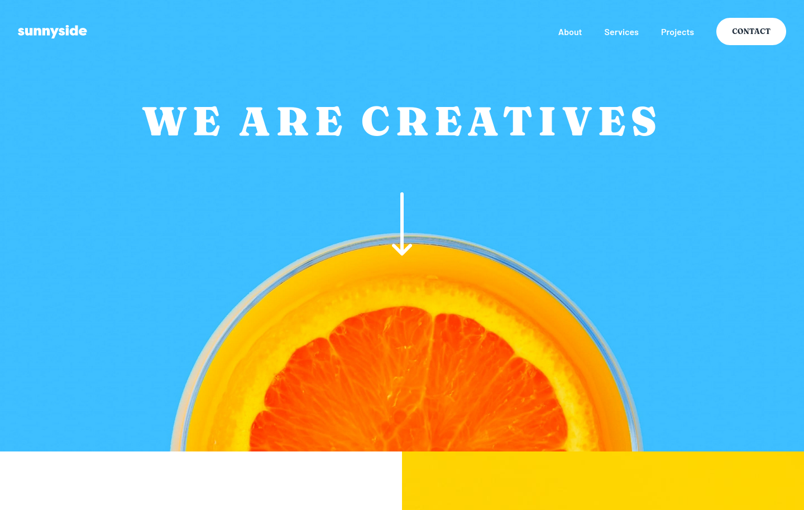

# Sunnyside agency landing page

This is a solution to the [Sunnyside agency landing page challenge on Frontend Mentor](https://www.frontendmentor.io/challenges/sunnyside-agency-landing-page-7yVs3B6ef). A live version of the site can be seen [here](https://sunnyside-elyosis.netlify.app/).

## Table of contents

- [Overview](#overview)
  - [The challenge](#the-challenge)
  - [Screenshot](#screenshot)
- [My process](#my-process)
  - [Built with](#built-with)
  - [What I learned](#what-i-learned)

## Overview

### The challenge

Users should be able to:

- View the optimal layout for the site depending on their device's screen size
- See hover states for all interactive elements on the page

### Screenshot

## My process

### Built with

- Semantic HTML5 markup
- CSS custom properties
- Flexbox
- CSS Grid
- Desktop-first workflow
- [Astro](https://astro.build/)

### What I learned

It took a great deal of trial and error but I believe I learned a lot on how to manage to make images responsive and how to work with them in general; this project was actually my first contact with the `<Picture />` element. It was also good to work with Astro on a project that's less about the content, which was what I had mainly focused on until now, and more about the layout. Lastly, something else I used more than expected was the `clamp()` CSS function. I barely had any experience with it before so it took some learning, but it's definitely a great tool to achieve responsive behavior.